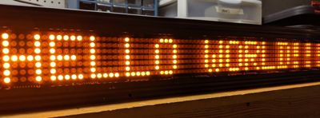
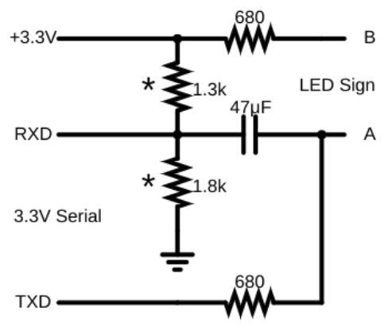

# Node.js Script and Circuit for NXTP7X962M LED Signs

Controls an LED sign with a 5V or 3.3V TTL serial port. I used a CP2102 USB to 3.3V serial module.

## Instructions
1. Edit serial port in index.js if not ttyUSB0. Use the COM name for your serial port if running Windows, e.g. COM2.
2. Run `yarn` to install dependencies.
3. Run `yarn start` to run. Shows "HELLO WORLD!!!" on the sign.

## Requirements
* Node.js
* Yarn
* One 5V or 3.3V TTL serial port

## Circuit

* Connects any TTL serial port to the LED sign's J1708 port. For example:
  * USB to TTL serial adapters (This project)
  * Raspberry Pi
  * Arduino
* Parts and values are flexible.
  * Any power/signal/schottky diode should work.
  * Can substitute similar values for the resistors.
* circuitjs.txt can be imported at https://www.falstad.com/circuit/
* Daisy chaining more than one sign has not been tested.

## Circuit Explanation
The circuit fakes a differential serial signal to drive the sign's J1708 port, i.e. pin A and pin B. It holds pin B at roughly half the single-ended serial voltage -- the 1k resistor drops the voltage due to the sign's sink current at pin B -- while driving pin A from the TXD pin of a regular TTL serial port thru a 1k resistor. The 220 ohm resistor is just protection that limits the max current to/from the sign.

The 10k resistor and diode clip the voltage at RXD to VCC to protect the RXD port, e.g. for 3.3V serial devices which may not be 5V tolerant, since the sign tries to bring pin A near 5V. If your RXD pin is 5V tolerant, you can replace the diode with a wire and omit the 10k resistor.
